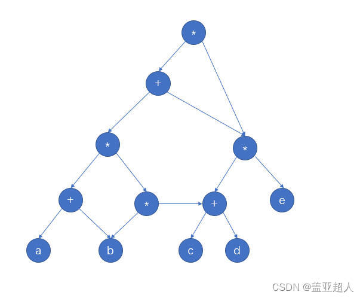

# 一、选择题
## 1.1.线性代数
### 1.1.1.关于行列式求值

### 1.1.2.如何求矩阵的秩

### 1.1.2.齐次方程式求解

## 1.2.概率

## 1.3.数据结构
### 1.3.1.十大经典排序算法

（1）冒泡排序

---
思想
比较相邻的元素。如果第一个比第二个大，就交换他们两个。

对每一对相邻元素作同样的工作，从开始第一对到结尾的最后一对。这步做完后，最后的元素会是最大的数。

针对所有的元素重复以上的步骤，除了最后一个。

持续每次对越来越少的元素重复上面的步骤，直到没有任何一对数字需要比较。

---
（2）选择排序

---
首先在未排序序列中找到最小（大）元素，存放到排序序列的起始位置。

再从剩余未排序元素中继续寻找最小（大）元素，然后放到已排序序列的末尾。

重复第二步，直到所有元素均排序完毕。

---

（3）插入排序

---

将第一待排序序列第一个元素看做一个有序序列，把第二个元素到最后一个元素当成是未排序序列。

从头到尾依次扫描未排序序列，将扫描到的每个元素插入有序序列的适当位置。（如果待插入的元素与有序序列中的某个元素相等，则将待插入元素插入到相等元素的后面。

---

（4）希尔排序

---

希尔排序又称缩小增量排序，基本思想是：先将整个待排序的记录序列分割成为若干子序列分别进行直接插入排序，待整个序列中的记录"基本有序"时，再对全体记录进行依次直接插入排序。

一般代码有两种实现方式，一个是穿插处理每一组，一种是处理完一个分组后处理下一个分组

---

（5）归并排序（时间复杂度为O(nlogn)和空间复杂度O(n)）

---

申请空间，使其大小为两个已经排序序列之和，该空间用来存放合并后的序列；

设定两个指针，最初位置分别为两个已经排序序列的起始位置；

比较两个指针所指向的元素，选择相对小的元素放入到合并空间，并移动指针到下一位置；

重复步骤 3 直到某一指针达到序列尾；

将另一序列剩下的所有元素直接复制到合并序列尾。

---

（6）快速排序(时间复杂度O(nlogn)和空间复杂度O(1)),一般比归并排序快,又称分区交换排序

---

从数列中挑出一个元素，称为 "基准"（pivot）;

重新排序数列，所有元素比基准值小的摆放在基准前面，所有元素比基准值大的摆在基准的后面（相同的数可以到任一边）。在这个分区退出之后，该基准就处于数列的中间位置。这个称为分区（partition）操作；

递归地（recursive）把小于基准值元素的子数列和大于基准值元素的子数列排序；

---

（7）堆排序（时间复杂度为O（n×1ogn）， 是不稳定排序）

---

大顶堆： 用于升序排序，每个节点的值都大于或等于其子节点的值
小顶堆： 用于降序排序，每个节点的值都小于或等于其子节点的值

创建一个堆 H[0……n-1]；

把堆首（最大值）和堆尾互换；

把堆的尺寸缩小 1，并调用 shift_down(0)，目的是把新的数组顶端数据调整到相应位置；

重复步骤 2，直到堆的尺寸为 1。

---

（8）计数排序

---

算法的步骤如下：
找出待排序的数组中最大和最小的元素

统计数组中每个值为i的元素出现的次数，存入数组C的第i项

对所有的计数累加（从C中的第一个元素开始，每一项和前一项相加）

反向填充目标数组：将每个元素i放在新数组的第C(i)项，每放一个元素就将C(i)减去1

---

（9）桶排序（计数排序的升级版）

---

划分桶：根据待排序数组的特点，将其划分成若干个桶，每个桶表示一个范围区间，桶的数量可以根据问题的要求来确定。

分配元素：遍历待排序数组，将每个元素根据其值的范围分配到相应的桶中。

对每个桶进行排序：对每个桶中的元素进行排序，可以选择合适的排序算法，如插入排序、快速排序等。

合并桶：将所有桶中的元素按照顺序依次合并，得到排序后的结果。

桶排序适用于待排序数组取值范围较小但是分布比较均匀的情况

---

（10）基数排序

---

基数排序VS桶排序VS计数排序

基数排序：根据键值的每位数字来分配桶；

计数排序：每个桶只存储单一键值；

桶排序：每个桶存储一定范围的数值；

---

[实现代码](sort.cpp)

### 1.3.2.小根堆、大根堆

大顶堆： 用于升序排序，每个节点的值都大于或等于其子节点的值
小顶堆： 用于降序排序，每个节点的值都小于或等于其子节点的值

### 1.3.3.KMP算法

手动如何计算匹配次数

### 1.3.4.有向无环图
一般做法
~~~bash
第一步：把各个操作数不重复的排成一排 

第二步：标出各个运算符的生效顺序（先后顺序可能会不同，但是只要符合运算法则就不伤大雅）

第三步：按顺序加入运算符，要分层加入。

第四步：从低向上逐层检查同层的运算符是否可以合体。
~~~

例子
$$
((a+b)*(b*(c+d))+(c+d)*e)*((c+d)*e)
$$

## 1.4.机器学习

### 1.4.1.决策树
（1）决策树是一种预测模型，代表对象属性和对象值之间的映射关系。决策树是一种树形结构，其中：
* 每个内部结点表示为一个属性的测试
* 每个分支表示一个测试输出
* 每个叶节点代表一种类别

（2）决策树核心部分
* 结点和有向边组成
* 结点有内部结点和叶节点两种类型
* 内部结点表示一个特征，叶节点表示一个类

（3）决策树生长流程

* 决策树的总体流程是从根结点开始到叶结点的递归过程，在每个中间结点寻找一个划分属性

（4）决策树停止生长条件

* 停止条件一：当前结点包含的样全属于同一类别
* 停止条件二：样本的属性取值都相同或属性集为空，不能划分
* 停止条件三：当前结点包含样本集合为空，不能再划分

（5）最优属性选择

* 信息熵

$$
Ent(D) = -\Sigma_{k=1}^{|y|}p_{k}log_2^{p_{k}}
$$

* 信息增益

$$
Gain(D, a) = Ent(D) - \Sigma_{v = 1}^{v}\frac{|D^{v}|}{|D|}Ent(D^{v})
$$

* 信息增益率

    因为信息增益会偏向取值较多的特征
$$
Gain_ratio(D, a) = \frac{Gain(D, a)}{IV(a)}
$$

$$
IV(a) = -\Sigma_{v=1}^{V}\frac{|D^{v}|}{|D|}* log_{2}^{\frac{|D^{v}|}{|D|}}
$$

（6）过拟合与剪枝

分支过多会导致过拟合

（7）预剪枝和后剪枝

* 预剪枝

在决策树生长过程中，对每个结点在划分前进行估计，若当前结点划分不能提升决策树范化性能，则停止划分当前结点为叶结点
* 后减枝

先从训练集生成一颗完整的决策树，然后自底向上地对非叶结点进行考察，若将该结点对应的子树替换为叶结点能带来决策树泛化性能的提升，则将该子树替换为叶结点。

（8）预剪枝和后剪枝的特点

时间开销

* 预剪枝：训练时间开销降低，测试时间开销变低
* 后剪枝：训练时间开销增加，测试时间开销变低

过拟合欠拟合风险

* 预剪枝：过拟合风险降低，欠拟合风险增加
* 后剪枝：过拟合风险降低，欠拟合风险基本不变

范化性能

* 后剪枝通常优于预剪枝

## 1.5、编程语言

### 1.5.1.设计模式

(1) 建造者模式

(2) 单例模式

(3)

### 1.5.2.

## 1.6.linux

### 1.6.1.IO多路复用

### 1.6.2.如何统计所有文件里面的代码行数

# 二、编程题
## 2.1.京东(2025算法开发工程师第四批)

（1）题目一
有一个字符串，需要写一个自动求下一个字符串的程序，下一个字符串的长度保持不变，例如输入aa，输出ab，输入aab，输出aac，如果输入zz,因为没有下一个字符串，输出-1

（2）题目二
现在给定一个数组，有两种操作，操作一：交换连续的两个元素，例如[1, 2]变为[2, 1],操作二：交换连续的三个元素，例如[1, 2, 3]变为[3, 2, 1]。现在对一个数组排序，同时保证尽可能的少用操作一，求最少的操作一的次数。

（3）题目三

现在有一个二行N列的二维数组，需要从（1, 1）到（2, N）， 两个人分为选择下一步（向上，向下，向右）

## 2.2.小红书（2025机器学习&音视频第一批）20240901

（1）题目一

求最长的山峰

如果有一个数组，存在子数组，前面的元素都严格递增到山峰，后面的元素都严格递减，例如[1, 1, 4, 5, 2, 3]中子数组[1, 4, 5, 2]是一个山峰，[1],[1, 2], [1, 2, 3]不是山峰

（2）题目二

求不美观度最小

有一个物品数组和一个是否可以移动的数组，物品数组有两个类别，一个类别1,一个类别2,一个是否可以移动的数组，0表示不能移动，1表示可以移动，定义如果两个相邻的物品类别不同，则不美观，如何移动物品使得不美观度最小

## 2.3.得物（得物25届秋招-算法工程C++-2）

（1）题目一（已经AC）

给定一个字符串，字符串字母都是大写，求其中没有出现过的ASCII码的数字和

例如：ABCDEFGHIJKLMNOPQRSTUVWXY,返回Z的ASCII码

（2）题目二（已经AC）

给定一个只包含小写字母的字符串，定义其中连续的相同出现的子字符串为“好串”，求相同字符的好串的个数的最大值，同时给定字符串的长度n，以及子字符串长度k，例如
8 3
aaabbaaa
好串个数为2

11 3
aaabbcccaaa
好串长度为2（aaa，ccc都满足，但aaa有两个，ccc只有一个，所以返回2）

（3）题目三（通过6%）

有一个N行M列的网格，里面存入".","B", "W", "*",
其中"."代表可以自由通行，"B"代表起点，"W"代表围墙，"*"代表终点，有三颗炸弹可以炸掉围墙，炸掉围墙也会前进一步，如何可以最少步数到终点，如果到不了返回-1

## 2.4.科大讯飞

## 2.5.深信服

## 2.6.帆软

## 2.7.美的

10道单选、5道不定向选择，3道编程题

（1）编程题一

给定离散曲线，一系列点，然后取两端的点，计算其余点到直线的距离，求的最大的距离d_max，然后与给定的距离D，如果d_max>=D，则继续以距离最大点为分解点，分为两条子曲线继续操作。如果小于D，则将中间的点全部删除，返回最终剩下来的点

（2）给定平面上的一系列点，求两点间的最短距离

# 三、编程题C++语法

## 3.1.set如何使用

~~~cpp

~~~

## 3.2.sqrt的使用

~~~cpp
#include <cmath>
~~~

