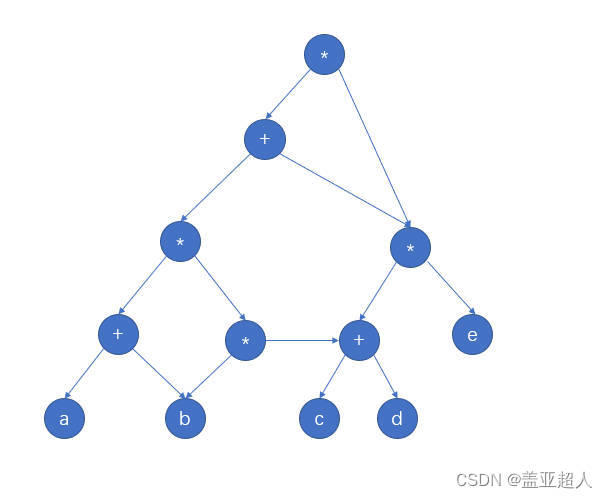

# 数据结构
## 1.十大经典排序算法

### （1）冒泡排序

思想
比较相邻的元素。如果第一个比第二个大，就交换他们两个。

对每一对相邻元素作同样的工作，从开始第一对到结尾的最后一对。这步做完后，最后的元素会是最大的数。

针对所有的元素重复以上的步骤，除了最后一个。

持续每次对越来越少的元素重复上面的步骤，直到没有任何一对数字需要比较。

### （2）选择排序

首先在未排序序列中找到最小（大）元素，存放到排序序列的起始位置。

再从剩余未排序元素中继续寻找最小（大）元素，然后放到已排序序列的末尾。

重复第二步，直到所有元素均排序完毕。

### （3）插入排序

将第一待排序序列第一个元素看做一个有序序列，把第二个元素到最后一个元素当成是未排序序列。

从头到尾依次扫描未排序序列，将扫描到的每个元素插入有序序列的适当位置。（如果待插入的元素与有序序列中的某个元素相等，则将待插入元素插入到相等元素的后面。

### （4）希尔排序

希尔排序又称缩小增量排序，基本思想是：先将整个待排序的记录序列分割成为若干子序列分别进行直接插入排序，待整个序列中的记录"基本有序"时，再对全体记录进行依次直接插入排序。

一般代码有两种实现方式，一个是穿插处理每一组，一种是处理完一个分组后处理下一个分组

### （5）归并排序（时间复杂度为O(nlogn)和空间复杂度O(n)）

申请空间，使其大小为两个已经排序序列之和，该空间用来存放合并后的序列；

设定两个指针，最初位置分别为两个已经排序序列的起始位置；

比较两个指针所指向的元素，选择相对小的元素放入到合并空间，并移动指针到下一位置；

重复步骤 3 直到某一指针达到序列尾；

将另一序列剩下的所有元素直接复制到合并序列尾。

### （6）快速排序(时间复杂度O(nlogn)和空间复杂度O(1)),一般比归并排序快,又称分区交换排序

从数列中挑出一个元素，称为 "基准"（pivot）;

重新排序数列，所有元素比基准值小的摆放在基准前面，所有元素比基准值大的摆在基准的后面（相同的数可以到任一边）。在这个分区退出之后，该基准就处于数列的中间位置。这个称为分区（partition）操作；

递归地（recursive）把小于基准值元素的子数列和大于基准值元素的子数列排序；

### （7）堆排序（时间复杂度为O（n×1ogn）， 是不稳定排序）

大顶堆： 用于升序排序，每个节点的值都大于或等于其子节点的值
小顶堆： 用于降序排序，每个节点的值都小于或等于其子节点的值

创建一个堆 H[0……n-1]；

把堆首（最大值）和堆尾互换；

把堆的尺寸缩小 1，并调用 shift_down(0)，目的是把新的数组顶端数据调整到相应位置；

重复步骤 2，直到堆的尺寸为 1。

### （8）计数排序

算法的步骤如下：
找出待排序的数组中最大和最小的元素

统计数组中每个值为i的元素出现的次数，存入数组C的第i项

对所有的计数累加（从C中的第一个元素开始，每一项和前一项相加）

反向填充目标数组：将每个元素i放在新数组的第C(i)项，每放一个元素就将C(i)减去1

### （9）桶排序（计数排序的升级版）

划分桶：根据待排序数组的特点，将其划分成若干个桶，每个桶表示一个范围区间，桶的数量可以根据问题的要求来确定。

分配元素：遍历待排序数组，将每个元素根据其值的范围分配到相应的桶中。

对每个桶进行排序：对每个桶中的元素进行排序，可以选择合适的排序算法，如插入排序、快速排序等。

合并桶：将所有桶中的元素按照顺序依次合并，得到排序后的结果。

桶排序适用于待排序数组取值范围较小但是分布比较均匀的情况

### （10）基数排序

基数排序VS桶排序VS计数排序

基数排序：根据键值的每位数字来分配桶；

计数排序：每个桶只存储单一键值；

桶排序：每个桶存储一定范围的数值；

[实现代码](sort.cpp)

## 1.2.小根堆、大根堆

大顶堆： 用于升序排序，每个节点的值都大于或等于其子节点的值
小顶堆： 用于降序排序，每个节点的值都小于或等于其子节点的值

## 1.3.KMP算法

手动如何计算匹配次数

## 1.4.有向无环图
一般做法
~~~bash
第一步：把各个操作数不重复的排成一排 

第二步：标出各个运算符的生效顺序（先后顺序可能会不同，但是只要符合运算法则就不伤大雅）

第三步：按顺序加入运算符，要分层加入。

第四步：从低向上逐层检查同层的运算符是否可以合体。
~~~

例子
$$
((a+b)*(b*(c+d))+(c+d)*e)*((c+d)*e)
$$

## 1.5.最大团

在给定的一张无向图中，找到一个包含最多顶点的子图，使得该子图是一个完全子图，即子图中的任意两个顶点之间都有一条边相连。
